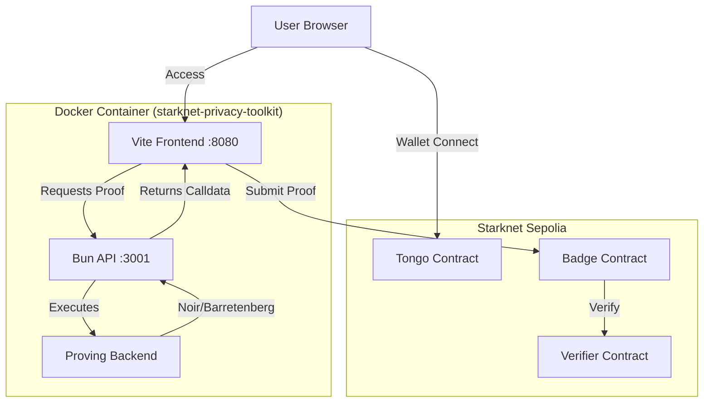

# 🛠️ Developer Guide & Architecture Reference

This document provides a deep technical dive into the **Starknet Privacy Toolkit** architecture and development workflows. It is intended for developers who want to contribute, modify, or debug the system.

## 🏗️ System Architecture

The project is runs entirely within a Docker container to ensure reproducibility of the ZK toolchain.

### Component Interaction



### Key Directories

| Directory | Purpose |
|-----------|---------|
| `/src` | Shared source code (Frontend logic, types, utils) |
| `/src/web` | **Frontend Application** (Vite + HTML + CSS) |
| `/api` | **Backend API** (Bun server for proof generation) |
| `/zk-badges` | **Noir Circuits** (The ZK logic) |
| `/donation_badge_verifier` | **Cairo Contracts** (Verifier & Badge NFT) |
| `/deployments` | JSON files tracking contract addresses per network |

---

## 🐳 Docker Development Environment

We use a **multi-stage Docker build** to package all ZK tools (Noir, Barretenberg, Garaga, Scarb) and the application runtime (Bun).

### 🚀 Quick Start Commands

We provide a helper script (`docker-helper.ps1` for Windows, `docker-helper.sh` for Linux/Mac) to simplify common tasks.

| Action | Command (Windows) | Command (Linux/Mac) | Description |
|--------|-------------------|---------------------|-------------|
| **Start** | `.\docker-helper.ps1 start` | `./docker-helper.sh start` | Builds and starts the dev server |
| **Build** | `.\docker-helper.ps1 build` | `./docker-helper.sh build` | Rebuilds the Docker image |
| **Logs** | `.\docker-helper.ps1 logs` | `./docker-helper.sh logs` | Tails container logs |
| **Stop** | `.\docker-helper.ps1 stop` | `./docker-helper.sh stop` | Stops and removes containers |
| **Shell** | `.\docker-helper.ps1 shell` | `./docker-helper.sh shell` | Opens a terminal inside the container |

### 🔧 Manual Docker Commands

If you prefer standard Docker commands:

```bash
# Build the image
docker-compose build

# Start in background
docker-compose up -d

# View logs
docker-compose logs -f

# Execute a command inside container
docker-compose exec app <command>
```

---

## 💻 Development Workflow

### 1. Frontend Development (`src/web`)
*   **Hot Reload**: The `src` directory is mounted as a volume. Changes to files in `src/web` are reflected immediately in the browser at `http://localhost:8080`.
*   **Wallet Integration**:
    *   **Argent X**: Supported (Multicall fix applied).
    *   **Braavos**: Fully supported.
    *   **Logic**: See `src/tongo-service.ts` for wallet interactions.

### 2. Backend API Development (`api/`)
*   **EntryPoint**: `api/server.ts`
*   **Port**: 3001
*   **Function**: Receives proof requests, runs `generate-proof.sh` inside the container, and returns calldata.
*   **Testing**:
    ```bash
    curl -X POST http://localhost:3001/api/generate-proof \
      -H "Content-Type: application/json" \
      -d '{"donation_amount": 1000, "threshold": 1000, "donor_secret": "hunter2", "badge_tier": 1}'
    ```

### 3. ZK Circuit Development (`zk-badges/`)
To compile circuits after modifying `.nr` files:

```bash
# Inside the container
docker-compose exec app bash -c "cd /app/zk-badges/donation_badge && nargo compile"
```

### 4. Smart Contract Development (`donation_badge_verifier/`)
To build Cairo contracts:

```bash
# Inside the container
docker-compose exec app bash -c "cd /app/donation_badge_verifier && scarb build"
```

---

## 🐛 Troubleshooting & Common Issues

### 1. "Argent multicall failed" / "Proof Of Ownership failed"
*   **Cause**: Argent wallet has strict validation for multicalls (Approve + Fund in one tx).
*   **Fix**: The code in `src/tongo-service.ts` has been patched to execute transactions sequentially:
    1.  `approve` (wait for confirmation)
    2.  `fund` (wait for confirmation)
    *   **Note**: You will see two transaction prompts in your wallet.

### 2. "Vite: Failed to resolve import"
*   **Cause**: Importing files that don't exist in the project structure (likely from legacy code).
*   **Fix**: Check `src/web/index.html`. We recently removed `lightning-service.ts` imports. If you see build errors, ensure unused imports are commented out or mocked.

### 3. Docker: "404 Not Found" during bun install
*   **Cause**: Stale `package-lock.json` with old URLs.
*   **Fix**: The Dockerfile is configured to verify `package.json` and generate a fresh lockfile. Run `docker-compose build` to fix.

### 4. "Bind for 0.0.0.0:8080 failed"
*   **Cause**: Another service is using port 8080 on your host.
*   **Fix**: Stop the confusing service or modify `docker-compose.yml` to map to a different host port (e.g., `"8081:8080"`).

### 5. API returns `{"error":"Not found"}` at root
*   **Context**: Visiting `http://localhost:3001/`
*   **Status**: **Normal**. The API only has endpoints at `/api/...`, not at root.

---

## 📦 Toolchain Versions

The Docker container enforces these specific versions to guarantee compatibility:

| Tool | Version | Notes |
|------|---------|-------|
| **Noir** | `1.0.0-beta.1` | ZK Circuit Compiler |
| **Barretenberg** | `0.67.0` | Proving Backend |
| **Garaga** | `0.15.5` | Verifier Generator |
| **Scarb** | `2.9.2` | Cairo Package Manager |
| **Bun** | `Latest` | JS Runtime |

> **Warning**: Upgrading one component without checking others will likely break proof verification.
